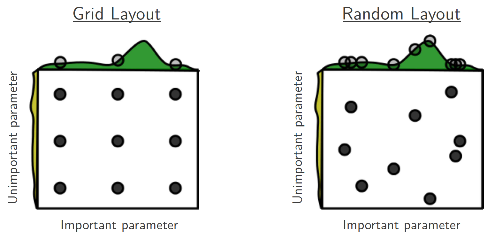
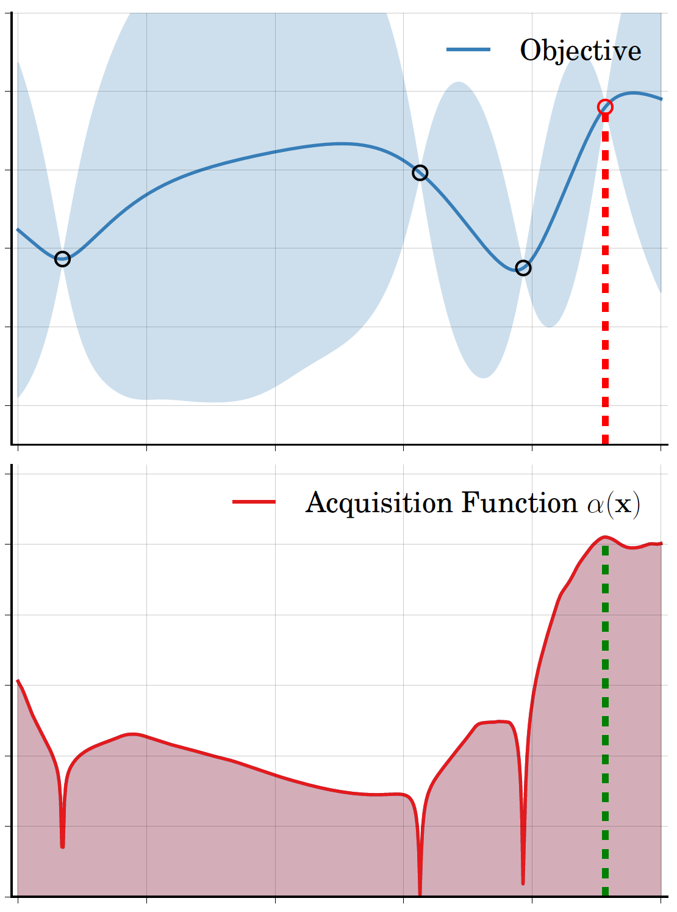
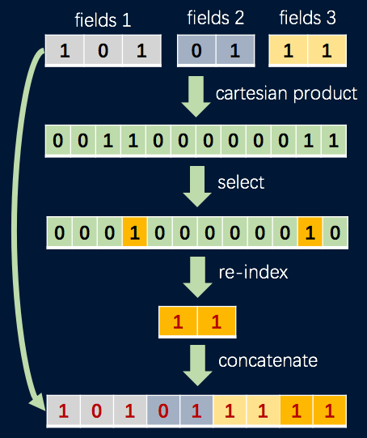

# AutoML

Angel's automatic machine learning toolkit.

Angel-AutoML provides automatic hyper-parameter tuning and feature engineering operators.
It is developed with Scala. 
As a stand-alone library, Angel-AutoML can be easily integrated in Java and Scala projects.

We welcome everyone interested in machine learning to contribute code, create issues or pull requests. Please refer to  [Angel Contribution Guide](https://github.com/Tencent/angel/blob/master/CONTRIBUTING.md) for more detail.

## Hyper-parameter tuning

### Strategies
Angel-AutoML has three tuning strategies, i.e., Grid search, Random search, and Bayesian optimization.





- **Grid search** equally divides the search space into grids with a fundamental assumption that the distributions of hyper-parameters are uniform. 
Though intuitive, grid search has two significant drawbacks: 1) the computing cost increases exponentially with respect to the number of parameters; 
and 2) the distributions of hyper-parameter are usually not uniform in real cases. 
Thus, grid search might spend great efforts on optimizing less important hyper-parameters in many cases.
- **Random search** randomly samples a sequence of hyper-parameter combinations from the configuration space, 
and evaluates the sampled combinations. 
Though this approach can be more likely to pay more attention to more important hyper-parameters, 
there is still no guarantee of finding the optimal combination.
- **Bayesian optimization (BO)** is different from the traditional modeless methods.
It treats the tuning problem as a black-box function, where the input is the hyper-parameter combination, 
and the output is the model metric such as accuracy and auc.
BO uses a cheap surrogate function to approximate the unknown target function. 
The surrogate function generates the probabilistic mean and variance of a given hyper-parameter combination. 
Then, an acquisition function evaluates the expected improvement of the generated combination.
The hyper-parameter combination with highest improvement is chosen to conduct the next evaluation.
This suggest-evaluate-feedback process iterates until convergence.
Such a probabilistic interpretation approach enables Bayesian optimization to find the optima with much less evaluations on target function. 

For BO, Angel-AutoML implements a series of surrogate functions and acquisition functions.
-	**Surrogate function**: Gaussian process and random forest. 
We also implement the EM+LBFGS to optimize the hyper-parameters in kernel functions of Gaussian process.  
-	**Acquisition function**: Probability of Improvement (PI), Expected Improvement (EI) and Upper Confidence Bound (UCB).

### Usage

The tuning component of Angel-AutoML provides easy-to-use interfaces.
Users can integrate it into their programs with fewer than 10 lines.

- **Define hyper-parameter space.**
Supported format of discrete hyper-parameter: {v1,v2,v3,v4} or {start:end:step}.
```scala
val param1 = ParamSpace.fromConfigString("param1", "{1.0,2.0,3.0,4.0,5.0}")
val param2 = ParamSpace.fromConfigString("param2", "{1:10:1}")
```
Supported format of continuous hyper-parameter: [start,end] or [start:end:num_of_elements]
```scala
val param1 = ParamSpace.fromConfigString("param1", "[1,10]")
val param2 = ParamSpace.fromConfigString("param2", "[1:10:10]")
```
- **Create solver of hyper-parameter tuning.**
The first param is hyper-parameters defined above.
The second param indicates whether the goal is minimizing the metric.
The third param defines the surrogate (Random, Grid, or GaussianProcess).
```scala
val solver: Solver = Solver(Array(param1, param2), true, surrogate = "Random")
```
- **Solver suggests a batch of hyper-parameter combinations.**
The default batch size is 100. You can change this value via TunerParam.setBatchSize().
```scala
val configs: Array[Configuration] = solver.suggest()
```
- **User evaluates the objective function with the suggested hyper-parameter combinations.**
```scala
val results: Array[Double] = objective.evaluate(configs)
```
- **User feeds the results to the solver.**
```scala
solver.feed(configs, results)
```
- Jump to Step 3 and iterate until convergence.

## Feature engineering

Feature engineering, such as feature selection and feature synthesis, has significant importance in industry level applications of machine learning.
Angel-AutoML implements useful feature engineering operators with Spark MLlib.
They can be easily assembled into Spark pipeline.

### Feature selection

Since the feature selection operators in Spark MLlib is not enough,
we enhance Spark by adding two categories of operators.
- Statistic-based operators, including VarianceSelector and FtestSelector.
- Model-based operators, including LassoSelector and RandomForestSelector.

### Feature synthesis

A majority of online recommendation systems choose linear models, such as Logistic Regression, 
as their machine learning model for its high throughput and low latency.
But Logistic Regression requires manual feature synthesis to achieve high accuracy,
which makes automatic feature synthesis essential. 
However, existing automatic feature synthesis methods simply generate high-order cross features by cartesian product, 
incurring problem of dimension curse.
Therefore, we propose Auto Feature synthesis (AFS), an iterative approach to generate high-order features.



In AFE, each iteration is composed of two stages:
- Amplification stage: cartesian product of arbitrary features
- Reduction stage: feature selection and feature re-indexing.

The above figure is an example of an AFS iteration:
-	The features are first amplified through a **cartesian product operator**. 
The number of features will increase quadratically after this step.
-	Next, the most important features are selected from the previous step by a **feature selector operator** (e.g. VarianceSelector and RandomForestSelector).
-	Then, the selected features are re-indexed to reduce the feature space by a **feature re-index operator**.
-	Finally, the generated features and the original features are concatenated by a **vector assembler operator**.
